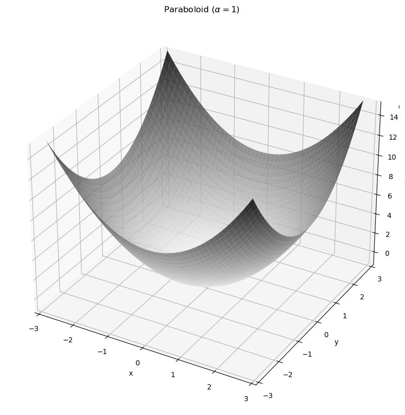
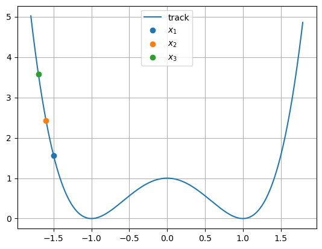

# 5 Sep 23 - Activity: Calculus of Variations and Lagrangian Dynamics

In this activity, you will work through an example Lagrangian dynamics problem. This problem is a standard one which sets up both our understanding of the Lagrangian and the Lagrangian equations of motion, but also coupled oscillators. The latter is a very important concept in physics, and we will see it again in the context of waves. In addition, we will change coordinate systems from Cartesian to polar coordinates on our way to generalized coordinates.

We should be considering all the conceptual questions asked because signs and distances matter in most Lagrangian problems. Setting up the problem incorrectly is the most common mistake (we've all made it many times) because the mathematical process is the same for every problem.

## Group Activity

### Simple Harmonic Oscillator (SHO)

*Note (for this and future problems): the form of the EOM might not look the same as the Newtonian approach, but with some algebra we can often see that they are equivalent.*

**&#9989; Do this** 

1. Starting with the 1d energy equations ($T$ and $V$) for a SHO; derive the equations of motion ($m\ddot{x}=-kx$). Use the Lagrangian approach. Did you get the sign right? 

### Canonical Coupled Oscillators

Let's assume you have a chain of two mass connected by springs (all with the same $k$) as below.


**&#9989; Do this** 

1. Write down the energy equations for this system (using $x_1$ and $x_2$ for coordinates)
2. Write the Lagrangian for this system.
3. Derive the two equations of motion. Why should there be two equations of motion?
3. Do all the signs makes sense to you? Why?
4. Could you have arrived at these equations in the Newtonian framework? No need to do so, just sketch out how you would have done it.

### Orbital Problem

Consider the 2 body orbital problem of a star and an planet under the force of gravity. Assume the star is stationary. 

**&#9989; Do this** 

1. Write down the energy equations for this system using polar coordinates. *Note: $v^2 = \dot{r}^2 + r^2\dot{\phi}^2$*
2. Write the Lagrangian. 
3. Derive the $r$ equation of motion. What do you notice about it's terms? Can you rewrite it in a Netwonian form?
4. Derive the $\phi$ equation of motion. What do you notice about it's time derivative? Does that tell you something about a quantity of the motion (i.e. a conserved quantity)? If so, what is it? 

## Additonal Examples

We will discuss constrained motion together in class. The code below is just to show you the shape of the constraints.

### Constrained Motion

The Lagrangian framework also excels at dealing with constrained motion, where it is usually not obvious what the constraint forces are. This is because you can write your generalized coordinates for your system in such a way that it contains the information


Consider a particle of mass $m$ constrained to move on the surface of a paraboloid $z =  c\rho^2$ subject to a gravitational force downward, so that the paraboloid and gravity are aligned.

**&#9989; Try this** 


1. Using cylindrical coordinates (why?), write down the equation of constraint. Think about where the mass must be if it's stuck on a paraboloid.
2. Write the energy contributions in cylindrical coordinates. (This is where you put in the constraint!)
3. Form the Lagrangian and find the equations of motion (there are two!)


```python
import numpy as np
import matplotlib.pyplot as plt

def parabaloid(x,y,alpha):
    # function of a paraboloid in Cartesian coordinates
    return alpha * (x**2 + y**2)

# points of the surface to plot
x = np.linspace(-2.8, 2.8, 50)
y = np.linspace(-2.8, 2.8, 50)
alpha = 1
# construct meshgrid for plotting
X, Y = np.meshgrid(x, y)
Z = parabaloid(X, Y,alpha)

# do plotting
fig = plt.figure(figsize = (10,10))
ax = plt.axes(projection='3d')
plt.title(r"Paraboloid ($\alpha = $" + str(alpha)+ ")")
ax = plt.axes(projection='3d')
ax.plot_surface(X, Y, Z, cmap='binary', alpha=0.8) 
ax.set_xlim(-3, 3); ax.set_ylim(-3, 3); ax.set_zlim(-1 ,15)
ax.set_xlabel('x')
ax.set_ylabel('y')
ax.set_zlabel('z')
plt.show()
```


    

    


### Roller Coaster on a Holonomic Track

Consider 3 roller coaster cars of equal mass $m$ and positions $x_1,x_2,x_3$, constrained to move on a one dimensional "track" defined by $f(x) = x^4 -2x^2 + 1$. These cars are also constrained to stay a distance $d$ apart, since they are linked. We'll only worry about that distance $d$ in the direction for now (though a fun problem would be to try this problem with a true fixed distance!)


```python
x = np.arange(-1.8,1.8,0.01)
track = lambda x : x**4 - 2*x**2 + 1
y = track(x)
d = 0.1
x1_0 = -1.5
x2_0 = x1_0 - d
x3_0 = x1_0 - 2*d
plt.plot(x,y, label = "track")
plt.scatter(x1_0,track(x1_0),zorder = 2,label = r"$x_1$")
plt.scatter(x2_0,track(x2_0),zorder = 2,label = r"$x_2$")
plt.scatter(x3_0,track(x3_0),zorder = 2,label = r"$x_3$")
plt.legend()
plt.grid()
plt.show()
```


    

    


**&#9989; Do this** 

1. Write down the equation(s) of constraint. How many coordinates do you actually need?
2. Write the energies of the system using your generalized coordinates.
3. Form the Lagrangian and find the equation(s?) of motion (how many are there?)
4. Are the dynamics of this system different that the dynamics of a system of just one roller coaster car?
