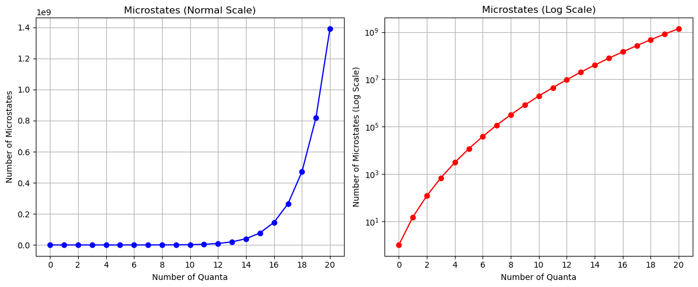
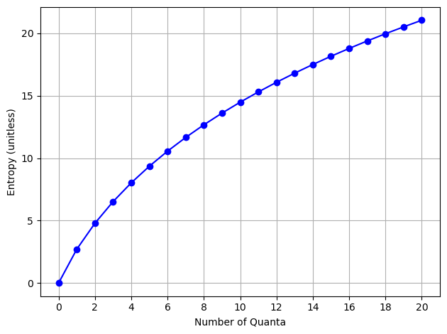

# 27 Nov 23 - Notes: Counting and Combinatorics

As we discussed, [entropy](https://en.wikipedia.org/wiki/Entropy) is a fundamental concept that quantifies the degree of disorder or randomness in a system. It was initially introduced in the mid-19th century in the field of [thermodynamics](https://en.wikipedia.org/wiki/Thermodynamics) by Rudolf Clausius, entropy was a measure of the unavailability of a system's energy to do work. 

## Statistical Mechanics and Combinatorics

In [statistical mechanics](https://en.wikipedia.org/wiki/Statistical_mechanics), developed by Ludwig Boltzmann and J. Willard Gibbs, entropy was redefined as a measure of uncertainty or information about a system. This brings in the concept of entropy as a measure of the number of possible microstates (specific arrangements of particles) corresponding to a macrostate (the observable state of the system). As it goes, the more microstates there are, the higher the entropy, and hence, the greater the disorder. This is an over-simplification of what is a fundamentally complex and interesting set of processes. This interpretation does bridge thermodynamics with statistical mechanics, offering a deeper understanding of temperature, pressure, and phase transitions in terms of atomic or molecular behavior as we will see with [the ideal gas law](https://en.wikipedia.org/wiki/Ideal_gas_law) and the [Ising model](https://en.wikipedia.org/wiki/Ising_model).

As we transition from a conceptual understanding of entropy to its mathematical formulation, combinatorics plays a crucial role. [Combinatorics](https://en.wikipedia.org/wiki/Combinatorics) is the branch of mathematics dealing with combinations and arrangements of objects, becomes essential in quantifying the number of microstates in a system. For instance, the concept of permutations and combinations helps in counting the possible arrangements of particles under given constraints, which is fundamental in calculating entropy. 

In statistical mechanics, the number of microstates ($\Omega$) is directly used in Boltzmann's entropy formula, 

$$S = k \log(\Omega),$$

where $k$ is Boltzmann's constant. This formula encapsulates the idea that entropy is a measure of the logarithm of the number of ways in which a system can be arranged. The combinatorial approach in statistical mechanics provides a quantitative method to explore how microscopic properties (like the positions and velocities of particles) lead to macroscopic phenomena (like temperature and pressure) through the lens of entropy.

## Fundamentals of Combinatorics and Counting

We have to learn to count microstates and do that efficiently. These calculations will underlie a lot of the fundamentals to the statistical mechanics we will be doing. We will start with the basics of counting and combinatorics, which will be the foundation for understanding entropy and statistical mechanics. We will separate this into permutations (where the objects are distinguishable) and combinations (where the objects are indistinguishable).

### Permutations (Distinguishable Counting)

Permutations are arrangements of objects where the order matters. You have to be able to tell the difference between every object. For example, you might be wanting to determine the ways you can arrange 5 balls that are all different colors. *We get this is contrived, but it's helpful to illustrate* Well, there are five ways to pick the first ball, four ways to pick the second ball, three ways to pick the third ball, two ways to pick the fourth ball, and one way to pick the fifth ball. This gives us a total of 120 ways to arrange 5 balls. We can summarize this with $\Omega$ = number of ways,

$$\Omega(n) = n!$$

This [factorial](https://en.wikipedia.org/wiki/Factorial) function is the product of all positive integers up to $n$. For example, $5! = 5 \times 4 \times 3 \times 2 \times 1 = 120$. 

### Choosing a subset (Distinguishable Counting)

What if you are trying to choose a subset of these distinguishable objects? For example, you want to find the number of ways you can pick 3 of these objects out. Well there's five ways to pick the first object, four ways to pick the second object, and three ways to pick the third object. This gives us a total of 60 distinct ways to pick 3 items from 5 objects where the order matters. 

But can we better quantify that process. If we have $n$ objects and we want to choose $k$ objects, we can write this as,

$$\Omega(n,k) = \frac{n!}{(n-k)!}$$

Let's see that this works for our choices. We can make a table for all the potential choices of $k$. For $n=5$ objects, we can pick $k$ of them in $\Omega(5,k)$ ways.

| k    | $\Omega(5,k)$ | 
| ---- | ------------- | 
| 1    | 5             | 
| 2    | 20            |
| 3    | 60            |
| 4    | 120           |
| 5    | 120           |

*Note that these numbers can get really big and cause issues with overflow.* Sometimes you have to be careful how you form your calculations or store your numerical variables. 

#### Lecture Video

[Johnathan Gardner](https://inv.tux.pizza/channel/UC5KbWmC93TBhinPLqh5j2kg) has a nice set of videos on Thermodynamics and Statistical Mechanics. Below is short one on counting and combinatorics.

[](https://inv.tux.pizza/watch?v=tEQFftB1Pao)

- Non-Commercial Link: [https://inv.tux.pizza/watch?v=tEQFftB1Pao](https://inv.tux.pizza/watch?v=tEQFftB1Pao)
- Commercial Link: [https://youtube.com/watch?v=tEQFftB1Pao](https://youtube.com/watch?v=tEQFftB1Pao)


### Combinations (Indistinguishable Counting)

In statistical mechanics, our work is typically different from simple permutations. We are often interested in the arrangement of some important quantity (like energy) over the different bodies (atoms, molecules, etc) in the system. Here you can think of having a bunch of balls, each corresponding to an energy quantum. What we want to do is arrange those quanta over different bodies, put each ball into a bin. 

For example, for the [quantum harmonic oscillator](https://en.wikipedia.org/wiki/Quantum_harmonic_oscillator), we have a bunch of energy quanta that we want to arrange over the different energy levels. We don't care about the order of the energy quanta, just the number of quanta in each energy level. This is where combinations come in. For a system with 3 atoms, we don't care which atom is in which state, just that we know which states the collections of atoms are in. So 

Because ultimately, it's the combination of how the energy are distributed that determine the system's state. it's not how each quanta are distributed on each atom, molecule, or body. Let's do an example. Suppose we have $q=5$ quanta of energy to distribute amongst $N=2$ oscillators (think of them as atoms being put into a particular energy state). We can write down all the possible states if we use the pair of numbers ($N_1$, $N_2$) to denote the number of quanta in each oscillator. For example, (3, 2) means that oscillator 1 has 3 quanta of energy and oscillator 2 has 2 quanta of energy. We could write down all the possible states and count them up, but that's definitely not efficient, nor do we care about the order of the quanta.


### Derivation of the Einstein Counting Formula

The problem we set up is a classic one in statistical physics. It was originally attributed to Einstein. In fact the concept of an [Einstein solid](https://en.wikipedia.org/wiki/Einstein_solid) continues to be used. It is a model of a solid based on two assumptions:

1. Each atom in the solid is an independent 3D quantum harmonic oscillator.
2. All atoms oscillate with the same frequency.

The first assumption is a good one. The second one is not. But it's a good approximation for many solids. If we model the quanta as stars and the oscillators as lines. Where the lines separate the stars into bins.  This is the so called [Stars and bars model](https://en.wikipedia.org/wiki/Stars_and_bars_(combinatorics)). We avoid that language because in the US because it associated with a Southern hate group. In any event, here's an image to make sense of the model:


We can show that the total number of symbols we have is $q+N-1$, we get the $N-1$ because we need one less line to make a two bins. We can then write down the number of ways to arrange the symbols as,

$$\Omega(q,N) = \frac{(q+N-1)!}{q!(N-1)!}$$

where the denominator is the number of ways to arrange the $q$ quanta (stars) and the $N-1$ lines (or $N$ oscillators) separately. We can apply this model to a solid to compute the number of potential microstates for a given macrostate. 

#### Lecture Video

The video below does precisely that.

[](https://inv.tux.pizza/watch?v=71fk3n88t48)

- Non-Commercial Link: [https://inv.tux.pizza/watch?v=71fk3n88t48](https://inv.tux.pizza/watch?v=71fk3n88t48)
- Commercial Link: [https://youtube.com/watch?v=71fk3n88t48](https://youtube.com/watch?v=71fk3n88t48)


### Example: The Einstein Model of a small solid

Consider an Einstein solid consisting of 5 atoms, 15 oscillators. Let's allow ourselves to have 20 quantum of energy to distribute amongst the oscillators. How many microstates are there for this system? We can use the formula above to calculate this. But better yet, let's use Python to calculate and display the results.

Here $N=15$, but $q$ is anywhere from 0 to 20. So we will need to loop through and calculate.


```python
import matplotlib.pyplot as plt
import numpy as np

from math import factorial

def calculate_microstates(quanta, oscillators):
    """
    Calculate the number of microstates for an Einstein solid.
    quanta: Number of quanta of energy.
    oscillators: Number of oscillators.
    returns the number of microstates.
    """
    return factorial(quanta + oscillators - 1) / (factorial(quanta) * factorial(oscillators - 1))

# Number of quanta and oscillators
quanta = 20
oscillators = 15

# Calculate the number of microstates for a range of quanta values
quanta_values = np.arange(0, quanta + 1)
num_microstates = [calculate_microstates(q, oscillators) for q in quanta_values]
```


```python
# Create a figure with two subplots
fig, (ax1, ax2) = plt.subplots(1, 2, figsize=(12, 5))

# Plot the number of microstates in normal scale
ax1.plot(quanta_values, num_microstates, marker='o', linestyle='-', color='b')
ax1.set_xlabel('Number of Quanta')
ax1.set_ylabel('Number of Microstates')
ax1.set_title('Microstates (Normal Scale)')
ax1.set_xticks(quanta_values[::2])
ax1.grid()

# Plot the number of microstates in log scale
ax2.semilogy(quanta_values, num_microstates, marker='o', linestyle='-', color='r')
ax2.set_xlabel('Number of Quanta')
ax2.set_ylabel('Number of Microstates (Log Scale)')
ax2.set_title('Microstates (Log Scale)')
ax2.set_xticks(quanta_values[::2])
ax2.grid()

# Adjust layout for better visualization
plt.tight_layout()
```


    

    


### What about the entropy?

We can compute it using the formula above, but for our purposes, we will just use the logarithm of the number of microstates.

$$S/k = \log(\Omega)$$

Notice that our log scale graph above looks exactly like the entropy graph. The number of microstates is a measure of the entropy. 


```python
entropy = np.log(num_microstates)
plt.plot(quanta_values, entropy, marker='o', linestyle='-', color='b')
plt.xlabel('Number of Quanta')
plt.ylabel('Entropy (unitless)')
plt.xticks(quanta_values[::2])
plt.grid()
plt.tight_layout()
```


    

    


## Additional Resources

If you want more details on combinatorics, please review this longer lecture.

[](https://inv.tux.pizza/watch?v=6oV3pKLgW2I)

- Non-Commercial Link: [https://inv.tux.pizza/watch?v=6oV3pKLgW2I](https://inv.tux.pizza/watch?v=6oV3pKLgW2I)
- Commercial Link: [https://youtube.com/watch?v=6oV3pKLgW2I](https://youtube.com/watch?v=6oV3pKLgW2I)


